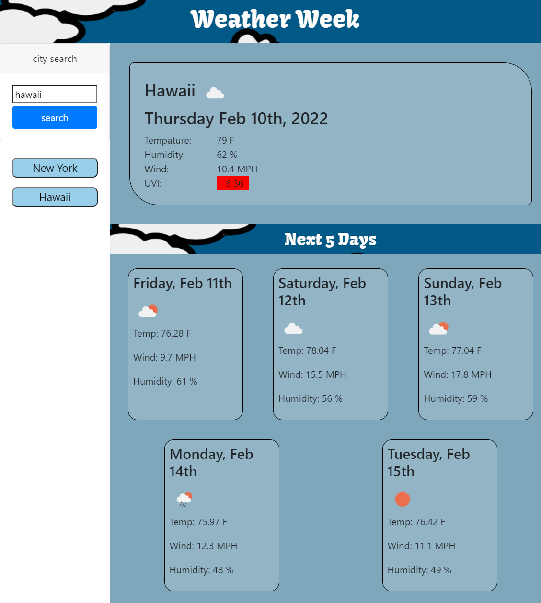

# weatherWeek

With this website you can search any city and find out its weather. the weather will be stored in the history as a button for future use. when the weather is diplayed it will show the current weather with its tempature in farenheit, wind speed in mph, the humidity percentage and the uvi index. underneath will display the next five days of weather with similar display data.

## link

[link](https://holbrookb23.github.io/weatherWeek/)

## screenshot

